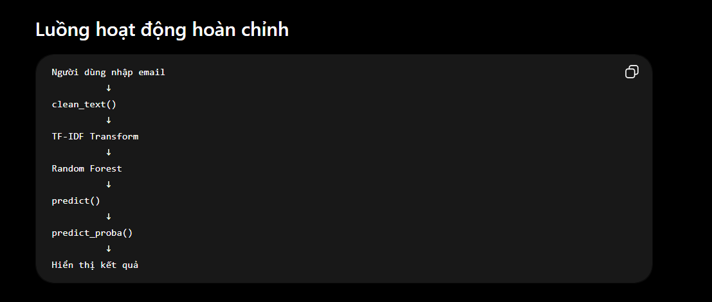

# Thư viện sử dụng
- pandas
- numpy
- scikit-learn
- streamlit
- nltk
- joblib

# Thư mục APP
    app.py
    preprocess.py: chứa các hàm tiền xử lý văn bản nhằm đảm bảo 
    dữ liệu đầu vào của website được xử lý giống với dữ liệu sử dụng trong 
    quá trình huấn luyện mô hình.

#  Thư mục Streamlit 
File config.toml được sử dụng để tùy chỉnh giao diện của ứng dụng Streamlit như màu nền, màu chữ và màu các thành phần giao diện nhằm tăng tính trực quan cho hệ thống.